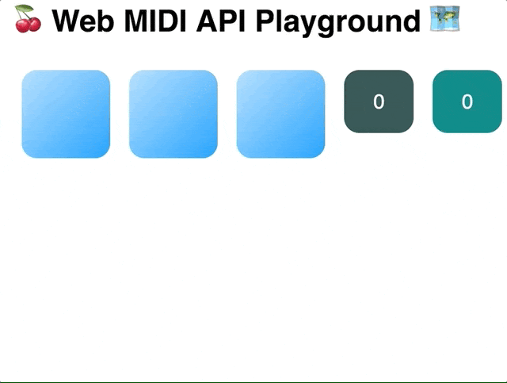

Web MIDI API playground 🍒
==========================

This small Javascript project should only show how easy it is to use the native `Web MIDI API` and an external MIDI device to have some fun. It's built within one day.



e.g. three MIDI control dials and CSS-Variables used to change the background color with `rgb()`.

**CSS:**
```
:root {
    --r: 255;
    --g: 255;
    --b: 255;
    --bgcolor: rgb(var(--r), var(--g), var(--b));
}

body {
    background-color: var(--bgcolor);
}
```
**JS:**
Incoming data from midi device is used to set css variables
```
// velocity range is typically from 0 to 127.
document.documentElement.style.setProperty(
    '--r',
    Math.round(data.velocity / 127 * 255)
);

```

Further more the `Web Audio API` is used to fire up some sounds like a drum machine.

## Ingredients

* audio-loader to get `AudioBuffer`
* Tone.js to fire up some local loaded sounds
* React (create-react-app) as the container app 
* My React component `MidiControllerBase` for getting MIDI data (don't renders - see https://facebook.github.io/react/docs/conditional-rendering.html#preventing-component-from-rendering)


## How to use

1. Plugin your midi device
2. Put some .wav or .mp3 files into the folder `/public/sounds/*`
3. Setup the path's for the sound files in `Sound.js`
4. Check the incoming `noteNumber` of your midi device (@see `App.js`)
4. `yarn start`


## My MIDI device

I am using the AKAI [MPIK MINI](http://www.akaipro.de/mpk-mini) on a mac machine.

## Conclusion

* very fast, low latency for midi inputs (USB connected) - it feels like a real DAW
* [Tone.js](https://tonejs.github.io/) is fantastic!
* CSS-Variables are very nice
